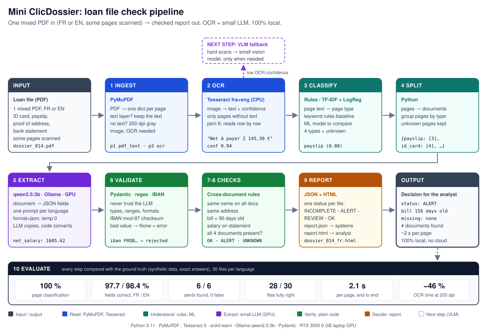
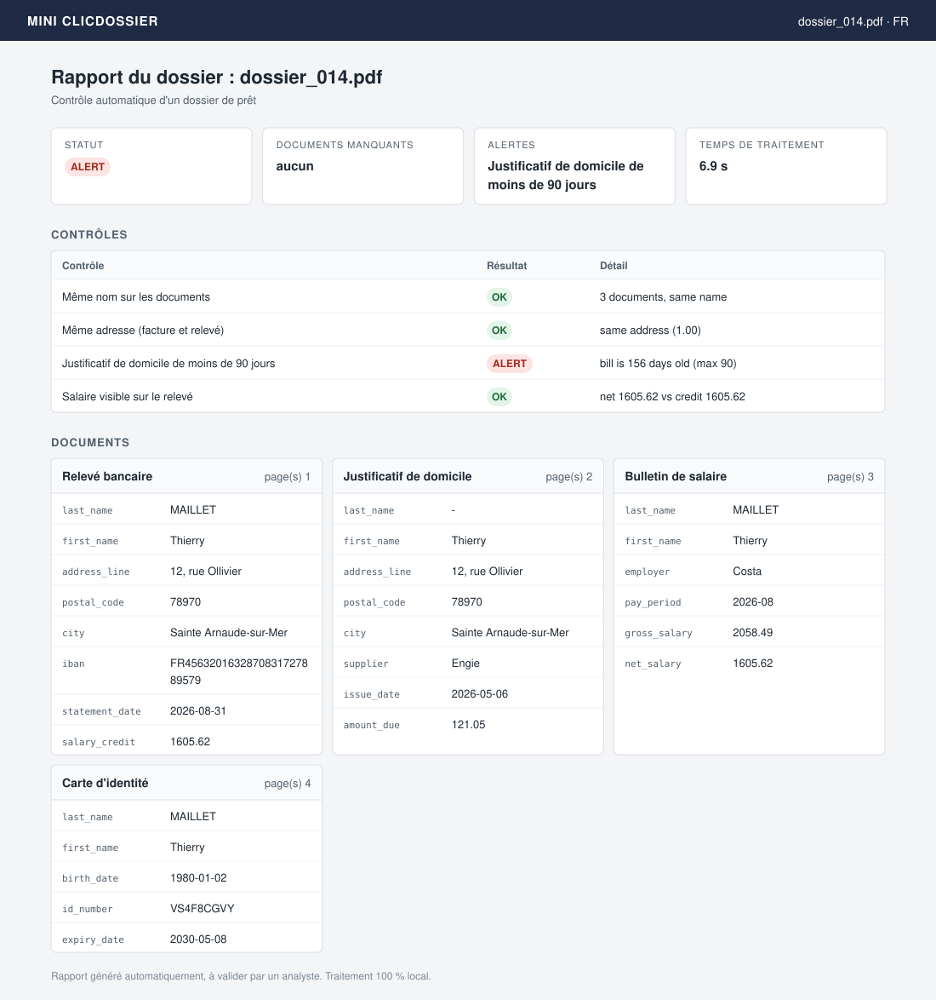

# Mini ClicDossier

A 100% local document AI pipeline that does the first check of a loan file, in French and English.
One mixed PDF goes in (ID card, payslip, proof of address, bank statement, some pages scanned).
A report comes out for the analyst: is the file complete, what do the documents say,
and does anything not match?

## Why I built this

I'm a junior ML / AI engineer and I wanted to learn document AI the way banks and insurers in France
need it:

- **the documents can't leave the company.** Loan files are personal data (GDPR), so the models
  must run on the company's own servers, not through a cloud API;
- **French documents first**, with English next to it;
- **speed matters as much as accuracy**, because a bank processes thousands of files.

So instead of a notebook demo, I built the full chain end to end, with small open models on a
6 GB laptop GPU, and I measured accuracy and speed at every step. I wanted to understand where
such a system breaks, and why, not only make it work once.

## The problem it solves

When a bank receives a loan application, an analyst checks the file by hand:

1. **Are all the documents there?** ID card, payslip, proof of address, bank statement.
2. **What do they say?** Name, address, salary, IBAN, dates.
3. **Do they agree with each other?**
   - same name on every document;
   - same address on the bill and the bank statement;
   - proof of address less than 90 days old;
   - the net salary from the payslip really arrives on the bank account.

This is slow and repetitive, and a missed mismatch can be fraud or a compliance problem.
Mini ClicDossier does this first pass automatically and tells the analyst where to look.
The analyst still makes the decision.

## How it works



Each step has one clear input and output, and each one can be run and checked alone
(`debug/debug_<step>.py`). The evaluation compares every step with the ground truth, so when
a file is wrong I can see which step broke first.

## French and English

The same pipeline handles both languages. To make the comparison fair, every loan file exists in
French and in English **with the same person and the same values**; only the labels and formats
change (`Net à payer : 2 145,30 €` / `Net pay: €2,145.30`, `31/08/2026` / `31 Aug 2026`).

| Step     | What changes with the language                                        |
| -------- | --------------------------------------------------------------------- |
| OCR      | nothing: Tesseract runs with `fra+eng` on every scanned page          |
| Classify | keywords for both languages; the ML model is trained on both          |
| Extract  | one prompt per language, same output fields                           |
| Checks   | nothing: they compare values, not words                               |
| Report   | titles and check names in the file's language; codes stay in English |

So a difference between the French and English results comes from the language, not from the data.

## What the analyst gets

One JSON report (for other systems) and one HTML report (for a person) per file.

**French example: `dossier_014`, status `ALERT`.** The proof of address is 156 days old (max 90).
Everything else matches.



- **French report:** [open the HTML page](https://ubaidur404786.github.io/mini-clicdossier/report_fr.html)
- **English example: `dossier_017`, status `OK`.** All 4 documents were found and every check passed.
  [Open the HTML page](https://ubaidur404786.github.io/mini-clicdossier/report_en.html)
  or [see the image](docs/report_en.svg).

The HTML reports are served from the `docs/` folder with GitHub Pages. All names and values are fake.

Possible statuses, first match wins:

| Status       | Meaning                                                   | Analyst action               |
| ------------ | --------------------------------------------------------- | ---------------------------- |
| `INCOMPLETE` | a required document is missing                            | ask the client for it        |
| `ALERT`      | documents disagree (name, address, old bill, salary)      | look at the alert            |
| `REVIEW`     | a value could not be read or checked                      | check that value by hand     |
| `OK`         | all documents present, all checks passed                  | normal processing            |

## Results

30 loan files per language (114 pages each), `qwen2.5:3b` on an RTX 3050 6 GB laptop GPU,
OCR at 200 dpi.

| Metric                                          | FR          | EN          |
| ----------------------------------------------- | ----------- | ----------- |
| Page classification, scanned pages (rules / ML) | 100 / 100 % | 100 / 100 % |
| Field extraction (end to end, exact match)      | 97.7 %      | 98.4 %      |
| Alerts found / false alerts                     | 6/6, 0      | 6/6, 0      |
| Files with the right status, alerts, missing    | 28/30       | 28/30       |
| Seconds per page (whole pipeline)               | 2.14        | 2.11        |

- **The 4 missed files all ended as `REVIEW`, never as a wrong `OK`.** In each one a field came
  back empty, so a check could not run. Causes: the LLM left a field null, or OCR read `O` for
  `0` in an IBAN and the checksum rejected it.
- **French and English score almost the same.** The small differences are within the LLM's
  run-to-run noise.
- **Time is mostly the LLM:** extraction ~75-85 %, OCR the rest, ingest and classification ~0.
  A 4-page file takes ~7 s.
- **Memory:** the Python process peaks at ~220 MB of RAM. The model uses ~2.1 GB of VRAM in Ollama.

### Optimization: OCR at 300 -> 200 dpi

I measured OCR alone on the 24 scanned pages (are the true name, IBAN, postal code and ID number
in the raw OCR text?), then re-ran the full evaluation.

| dpi | s per scanned page | mean OCR conf | true values found |
| --- | ------------------ | ------------- | ----------------- |
| 300 | 2.54               | 0.948         | 93.8 %            |
| 200 | 1.36               | 0.943         | 95.8 %            |
| 150 | 1.02               | 0.940         | 95.8 %            |

- **200 dpi made the OCR step 46 % faster** (54.4 s -> 29.5 s for the French set), with the
  same quality.
- **I did not pick 150:** the gain is small, confidence keeps dropping, and real scans are
  worse than mine.
- **Seconds per page for the whole pipeline did not move** (2.15 -> 2.14). OCR was only ~22 %
  of the time, so the next real gain is in the LLM step.

## Why OCR + LLM, and what comes next (VLM)

I split the work between cheap tools and the LLM:

- **OCR (Tesseract, CPU)** only runs on scanned pages. Pages with a text layer skip it.
- **The small LLM (qwen2.5:3b, GPU)** turns the text of one document into JSON fields.
  It handles different layouts and both languages, where regex templates would break.
- **Plain code** does everything that must be exact: converting amounts and dates, validation
  (types, ranges, IBAN checksum) and the cross-document checks. The LLM never has the last word.

A **VLM** (vision language model) reads the page image directly, so it also sees the layout,
tables, stamps and handwriting that OCR loses. But it is heavier and slower than OCR plus a 3B LLM.

**My next step is to use a VLM only where it is needed:** pages with low OCR confidence, or
documents whose fields fail validation. Most pages keep the fast path, and only the hard pages
pay the cost of the VLM.

## From pipeline to product

This project is the processing core, not a full application. `run(pdf_path, lang)` takes one PDF
and returns the report as a dict, so it can be wrapped without changing the steps:

- **an API** (e.g. FastAPI): upload a loan file, get a job id, then read the JSON report when it
  is ready. A queue makes the GPU handle one file at a time;
- **a web screen for analysts:** files sorted by status, the page image next to the extracted
  values, and a way to correct a value. Corrections become new test data for the evaluation;
- **logs of every decision** for audits;
- **deployment on the bank's own Linux GPU servers**, so documents never leave the bank.

## Design choices

- **A value that breaks a rule becomes `None` + an error, it is not kept.** A wrong value would
  give a false alert later; an empty one only gives "can't check" (`REVIEW`).
- **Checks have 3 results:** `OK`, `ALERT`, `UNKNOWN`. A missing value never becomes a fake alert.
- **Names and addresses are compared after normalization** (upper case, no accents) with a
  similarity score. Exact matching on OCR + LLM output gives false alarms.
- **Codes are always English:** field names, alert codes and statuses. Only the report text is
  French or English, so the evaluation compares the same codes for both languages.

## Data

I used synthetic data only. Real loan documents are personal data (GDPR) and not public,
and synthetic data gives exact ground truth for free.

- **People:** 30 fake people (Faker `fr_FR`, fixed seed), one ground truth JSON each in
  `data/ground_truth/`.
- **Documents:** each one is drawn as a PDF with reportlab, in French and in English with the
  same values.
- **Scenarios:**
  - 12 ok;
  - 6 missing document;
  - 6 mismatch (other address, bill older than 90 days, salary not on the statement);
  - 6 scanned (image only, gray, small rotation, blur, noise).
- **Loan files:** the documents of one person are merged into one loan file in a shuffled order.
  A JSON label file comes with each one (true type of each page, expected missing documents and
  alerts) and is used by the evaluation.
- **Not in the repo:** the generated PDFs. The scripts rebuild them (see below).

## How to run

Needs Python 3.11, [Tesseract](https://github.com/tesseract-ocr/tesseract) with French and English
data, and [Ollama](https://ollama.com). Commands are for Windows PowerShell; on Linux activate the
venv with `source .venv/bin/activate`.

```
python -m venv .venv
.venv\Scripts\Activate.ps1
python -m pip install -r requirements.txt
ollama pull qwen2.5:3b
```

Build the data (in this order):

```
python -m src.generate.fake_people
python -m src.generate.make_docs
python -m src.generate.scan_effects
python -m src.generate.make_loan_files
```

Train the page classifier:

```
python -m src.classify
```

Run one file. The arguments are the PDF, the language (`fr` or `en`) and, optionally, the
reference date (the day the file was received; today by default):

```
python -m src.pipeline data/loan_files/fr/dossier_014.pdf fr 2026-10-09
python -m src.pipeline data/loan_files/en/dossier_017.pdf en 2026-10-09
```

Run the evaluation (`fr`, `en` or `both`) and the DPI test:

```
python -m eval.evaluate both
python -m eval.dpi_test fr
```

Reports go to `outputs/`, evaluation results to `outputs/eval/`.
Before measuring speed, check that `ollama ps` shows `100% GPU`.

## Project structure

```
src/generate/        synthetic people, pdf documents, scan effects, loan files
src/                 ingest, ocr, classify, split, extract, validate, checks, report, pipeline
eval/                evaluate.py (accuracy per step, fr vs en, time, memory), dpi_test.py
debug/               one script per step to run and inspect it alone
data/ground_truth/   true values for each person
docs/                pipeline diagram and example reports (fr, en)
```

## Limits

- **Synthetic data with one fixed template per document type.** 100 % classification here shows
  the code works, not that it generalizes to real documents.
- **My scan effects are mild.** Real phone photos and faxes are much harder for OCR.
- **The test set is small:** 30 files per language. The LLM output also changes a little between
  GPU runs, so differences under ~1 % are noise.
- **Wrong values with the right shape still pass validation:** `Jeannec` for `Jeannenec`, or `O`
  for `0` in an ID number, which has no checksum.
- **Every document is one page,** and two documents of the same type (two payslips) would be merged.
- **The short detail messages in the report** ("bill is 156 days old") are English in both versions.

## Next steps

- **VLM fallback** for low-confidence pages and for documents that fail validation (see above).
- **A faster LLM step:** shorter prompts, one call per file instead of one per document.
- **Real scans:** test OCR and extraction on real scans (e.g. the SROIE receipts dataset) and on
  harder scan effects.
- **More document types:** more templates, and boundary detection for multi-page and repeated
  documents.
- **An API and an analyst screen** on top of `run()`.
